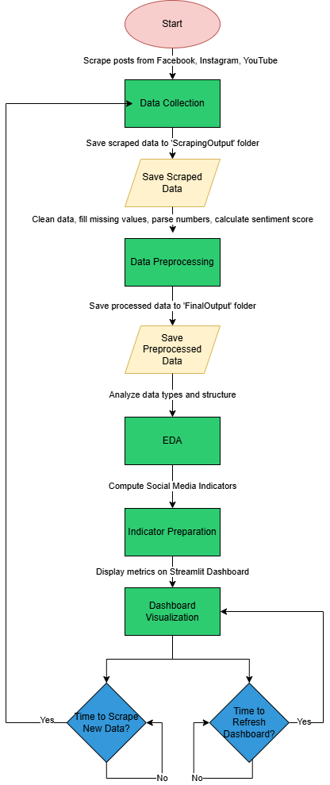

# Social Media Analytics Dashboard

This project provides a dashboard for analyzing social media metrics from platforms like Facebook, Instagram, and YouTube. It uses Python, Streamlit, and web scraping to fetch and display data in real-time.

---

## Table of Contents
1. [Prerequisites](#prerequisites)
2. [Setup Instructions](#setup-instructions)
3. [Running the Dashboard](#running-the-dashboard)
4. [System Flow](#system-flow)
5. [Auto-Refresh Feature](#auto-refresh-feature)
6. [Contributing](#contributing)

---

## Prerequisites

Before setting up the project, ensure you have the following installed:
- Python 3.8 or higher
- Git
- Jupyter Notebook (optional)
- Anaconda (optional, for managing Python environments)

---

## Setup Instructions

### 1. Clone the Repository
Clone the repository to your local machine using the following command:
```bash
git clone https://github.com/mohammdsobbahi2001/Social-Media-Analytics-Dashboard.git
```

### 2. Navigate to the Project Directory
Open a terminal (command prompt) and move to the project directory using the following command:
```bash
cd /path/to/Social-Media-Analytics-Dashboard
```
Replace /path/to/ with the actual path to the project on your machine.

### 3. Install Dependencies
Install the required Python libraries by running:
```bash
pip install -r requirements.txt
```
### 4. Configure Credentials
Update the constants.py file with your social media platform credentials (e.g., Facebook, Instagram, YouTube).

## System Flow  
The system operates through a structured process, as illustrated in the flowchart below: 

  

## Running the Dashboard
To start the Streamlit app, run the following command:
```bash
streamlit run streamlit_app.py
```

Once the app is running, open your browser and navigate to the local URL provided in the terminal (usually http://localhost:8501).

## Auto-Refresh Feature
The dashboard is designed to:
- Automatically scrape data every **30 minutes**.
- Refresh the displayed metrics every **5 minutes** to ensure the latest data is shown.


## Contributing
Contributions are welcome! If you'd like to contribute to this project, please follow these steps:
- Fork the repository.
- Create a new branch for your feature or bugfix.
- Submit a pull request with a detailed description of your changes.

